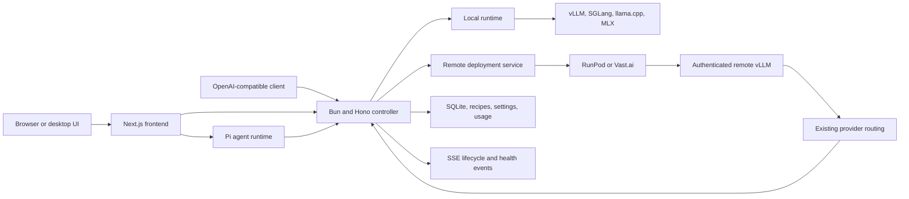

# ModelHost Studio

ModelHost Studio is a local-first control plane for running language models on
your own hardware or on a rented GPU. It combines model setup, runtime state,
OpenAI-compatible inference, an agent workbench, usage data, and remote GPU
lifecycle management in one controller and UI.

This repository is a fork of
[Local Studio](https://github.com/sybil-solutions/local-studio). The fork keeps
the upstream package names and `LOCAL_STUDIO_*` configuration namespace for
compatibility while it develops the ModelHost Studio product direction.

## What it does

- Downloads and serves model recipes through vLLM, SGLang, llama.cpp, or MLX.
- Shows model, runtime, GPU, logs, usage, and health state in one web interface.
- Exposes the active models through an OpenAI-compatible controller API.
- Runs Pi-based chat and agent sessions against local or connected models.
- Provisions authenticated vLLM servers on RunPod and Vast.ai from the Models UI.
- Stores remote provider credentials in the controller instead of returning
  them to the browser.

The same controller owns local model lifecycle and remote provider routes. A
remote model becomes available to the normal chat and API paths only after the
controller authenticates its health and model-list endpoints.

## Serving options

| Target            | Backends                | Hardware                | Lifecycle                           |
| ----------------- | ----------------------- | ----------------------- | ----------------------------------- |
| Apple Silicon     | MLX, llama.cpp          | Local unified memory    | Managed locally                     |
| Linux workstation | vLLM, SGLang, llama.cpp | Local NVIDIA GPU or CPU | Managed locally                     |
| RunPod            | vLLM                    | One rented NVIDIA GPU   | Provisioned and destroyed in the UI |
| Vast.ai           | vLLM                    | One rented NVIDIA GPU   | Provisioned and destroyed in the UI |

Remote deployment is intentionally narrow. The current MVP accepts Hugging
Face model IDs, estimates required VRAM from model weight size plus runtime
headroom, and lists compatible on-demand offers. It does not support remote
SGLang, AMD, multi-GPU inference, serverless endpoints, network volumes, or
automatic failover.

## Remote GPU flow

1. Create or save a vLLM recipe whose model source resolves to a Hugging Face
   repository.
2. Add a RunPod or Vast.ai API key under **Settings > Remote compute**. Add a
   Hugging Face token only for a private or gated repository.
3. Open **Models > Your servers**, open the recipe actions, and choose
   **Deploy remote**.
4. Compare compatible offers by GPU, memory, availability, and hourly price.
5. Deploy one offer. The controller creates the instance, starts an
   authenticated vLLM server, and waits for readiness.
6. Use the qualified model ID shown by the deployment, for example
   `remote-runpod-{deploymentId}/{model}`.
7. Select **Destroy** when finished. The provider route is removed, while the
   terminal deployment record remains available for audit history.

Creating a deployment starts a billable provider instance. Looking up offers
does not. Prices and availability are snapshots, and the MVP has no automatic
budget cap. Always destroy an instance when the test is complete.

## Architecture



The repository has two main application modules:

- [`controller/`](controller/README.md) contains the Bun/Hono API, local runtime
  coordination, provider routing, remote deployment supervision, persistence,
  usage, system state, and SSE events.
- [`frontend/`](frontend/README.md) contains the Next.js UI, Electron shell,
  agent workbench, controller proxy routes, and settings surfaces.

Shared controller contracts live in `controller/contracts/`. Shared agent
contracts live in `shared/agent/`. Remote deployment design, contracts, failure
handling, and acceptance evidence are documented in
[`docs/remote-gpu-provisioning.md`](docs/remote-gpu-provisioning.md).

## Quick start from source

Prerequisites:

- Bun 1.3.14 or newer
- Node.js 22.19 or newer
- npm 10 or newer
- Python 3.10 or newer
- Git
- `uv` for managed Python runtime installation, recommended

On Linux, vLLM and SGLang need a compatible NVIDIA driver and CUDA runtime.
Apple Silicon uses MLX for native GPU inference.

Install the locked workspace dependencies:

```bash
npm run doctor
npm run setup
```

The controller defaults to `/models` on macOS and Linux. Set a writable models
directory in the ignored root `.env.local` before the first launch:

```dotenv
LOCAL_STUDIO_MODELS_DIR=/absolute/path/to/models
```

Start the controller:

```bash
cd controller
bun run dev
```

In a second terminal, start the frontend and agent runtime from the repository
root:

```bash
NEXT_DIST_DIR=.next-dev npm run dev
```

Open these local pages:

- Models: <http://127.0.0.1:3000/models>
- Agent workbench: <http://127.0.0.1:3000/agent>
- Remote credentials: <http://127.0.0.1:3000/settings#remote>
- Controller health: <http://127.0.0.1:8080/health>
- Controller API reference: <http://127.0.0.1:8080/api/docs>

The setup wizard can install a local engine, download a model, save a server
recipe, launch it, and benchmark it. Engine environments are stored below the
controller data directory in `runtime/venvs/`.

## Use the API

List every model currently routed by the controller:

```bash
curl http://127.0.0.1:8080/v1/models
```

Send a chat completion after replacing `model-id` with an ID returned by that
endpoint:

```bash
curl http://127.0.0.1:8080/v1/chat/completions \
  -H 'Content-Type: application/json' \
  -d '{
    "model": "model-id",
    "messages": [{"role": "user", "content": "Hello"}],
    "stream": true
  }'
```

If the controller has an API key, add an `Authorization: Bearer ...` header
without storing the value in scripts, shell history, or source control.

## Agent workbench

The `/agent` surface uses `@earendil-works/pi-coding-agent`. It keeps the full
qualified provider model ID selected, so a remote deployment is not silently
replaced with an unqualified local model.

The model picker derives capabilities from controller metadata:

- Reasoning controls appear only for models that advertise reasoning support.
- The **Agent tools** switch can send a plain chat turn with an empty tool set.
- Models without tool-call support always use the empty tool set. This avoids
  sending vLLM `tool_choice: "auto"` when no tool-call parser is configured.
- Context limits come from the selected model. Small-context sessions compact
  before a request can overrun the model window.
- Vision input appears only when the selected model advertises image support.

Agent tools run with the permissions of the host user. Tool access is an agent
policy, not an operating-system sandbox.

## Credentials and network safety

Remote provider keys can be saved or rotated under **Settings > Remote
compute**. They are stored in the controller SQLite database with file mode
`0600`. Credential values are never returned by the settings API; the browser
receives only configured state and source.

For unattended controllers, these environment variables remain available as
fallbacks:

- `LOCAL_STUDIO_VAST_API_KEY`
- `LOCAL_STUDIO_RUNPOD_API_KEY`
- `LOCAL_STUDIO_HF_TOKEN`

Values saved in Settings take precedence. Keep `.env.local` ignored and never
commit credentials.

The controller binds to `127.0.0.1` by default. A non-loopback bind requires
`LOCAL_STUDIO_API_KEY` unless the operator explicitly enables
`LOCAL_STUDIO_ALLOW_UNAUTHENTICATED=true` on a trusted network. The frontend can
target another controller through `BACKEND_URL` or `NEXT_PUBLIC_API_URL`.

RunPod exposes the remote vLLM service through its HTTPS proxy. The current
Vast.ai path uses an authenticated direct HTTP port. The generated bearer key
protects inference, but the provider does not supply TLS for that direct path.

## Remote acceptance status

| Provider | Verified path                                                   | Current status                                                                 |
| -------- | --------------------------------------------------------------- | ------------------------------------------------------------------------------ |
| RunPod   | Settings to offer to provision to streamed inference to destroy | Passed with an RTX 3090 and Qwen3.8 27B Heretic W4A16 on 2026-08-30            |
| Vast.ai  | Settings to offer to provision and destroy                      | Creation and cleanup passed; a healthy inference endpoint has not been reached |

The controller-side nine-scenario contract probe passed on 2026-08-31. It
covered offer filtering and provider normalization, failed provisioning
cleanup, bootstrap failure, readiness timeout, explicit destroy, restart
reconciliation, external instance disappearance, and omission of secrets from
browser payloads.

Vast.ai offer filtering excludes pre-Ampere GPUs and requires CUDA compute
capability 8.0 or newer. A compatible VRAM estimate still cannot guarantee that
a particular checkpoint, quantization, CUDA kernel, or container image will
start successfully. See the remote provisioning document for the full failure
model and live-run notes.

## Production build

Build the frontend and bundled agent runtime:

```bash
npm run build
```

Start the controller and standalone frontend in separate terminals:

```bash
npm run start:controller
npm run start
```

The production frontend binds to `127.0.0.1` and defaults to port `4783`. Set
`PORT` to another port from 1024 through 65535 when needed. Use the repository
start command rather than plain `next start`, because the project launcher also
preserves the streaming setup.

Build or install the desktop app only through the repository scripts:

```bash
npm run desktop:build
scripts/install-desktop-app.sh dev
```

## Development

Run the full repository gate before handing off a change:

```bash
npm run check
```

This checks repository structure and contracts, controller quality, agent
runtime quality, frontend lint and types, dependency hygiene, and the production
frontend build.

Keep changes focused, start branches from the current upstream `dev`, use
conventional commits, and target `dev` with one scoped pull request. Do not
commit secrets, runtime data, model weights, generated build output, or local
environment files. Read [`AGENTS.md`](AGENTS.md) before contributing.

## Project map

| Path                      | Purpose                                                                  |
| ------------------------- | ------------------------------------------------------------------------ |
| `controller/`             | Controller API, persistence, inference proxy, local and remote lifecycle |
| `controller/contracts/`   | Shared controller wire contracts                                         |
| `frontend/`               | Web UI and Electron desktop shell                                        |
| `services/agent-runtime/` | Pi agent runtime service                                                 |
| `shared/agent/`           | Shared agent request and model contracts                                 |
| `docs/`                   | Architecture and operational documentation                               |
| `scripts/`                | Setup, validation, installation, and project automation                  |

## Upstream and license

ModelHost Studio builds on Local Studio and its open-source dependencies,
including [Pi](https://github.com/earendil-works/pi),
[vLLM](https://github.com/vllm-project/vllm),
[SGLang](https://github.com/sgl-project/sglang), and
[llama.cpp](https://github.com/ggml-org/llama.cpp).

See [`LICENSE`](LICENSE) for the repository license.
