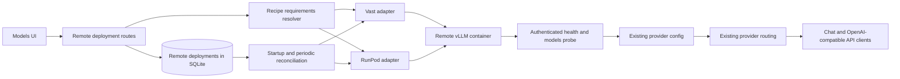

# Remote GPU provisioning

## Architecture summary

Remote GPU deployments should not become local `InstanceRecord` variants. A local instance record is also the local GPU lease, its state depends on a local launcher handle, and its health probe always targets a loopback port. Reusing that record for a rented machine would break all three invariants.

The remote deployment service will sit beside `modules/compute`. It will reuse recipe normalization and the pure vLLM launch plan, but it will own cloud offers, provider API calls, cloud lifecycle state, reconciliation, and teardown. Once a remote vLLM server is healthy, the service will register it as an ordinary OpenAI-compatible provider. Existing `providerId/model` routing, SSE streaming, model discovery, and usage accounting then work without a second inference proxy.



The fork has no `origin/dev` after a fresh fetch on 2026-08-29. The feature branch therefore starts at the fork's only remote head, `origin/main` at `6ff4ef9`.

## Proposed contracts

The shared wire contract belongs in `controller/contracts/remote-deployments.ts`.

```ts
type RemoteComputeProviderId = "vast" | "runpod";

interface RemoteComputeRequirements {
  recipe_id: string;
  model_id: string;
  backend: "vllm";
  min_vram_gb: number;
  gpu_count: 1;
  context_length: number;
  quantization: string | null;
}

interface RemoteComputeOffer {
  id: string;
  provider: RemoteComputeProviderId;
  gpu_name: string;
  gpu_memory_gb: number;
  gpu_count: number;
  system_memory_gb: number | null;
  cpu_cores: number | null;
  region: string | null;
  hourly_price: number;
  interruptible: boolean;
  reliability: number | null;
  availability: string | null;
  compatible: boolean;
}

interface RemoteDeploymentView {
  id: string;
  provider: RemoteComputeProviderId;
  provider_instance_id: string | null;
  recipe_id: string;
  model_id: string;
  backend: "vllm";
  status: RemoteDeploymentStatus;
  stage: RemoteDeploymentStage;
  message: string;
  offer: RemoteComputeOffer;
  remote_base_url: string | null;
  route_model_id: string | null;
  created_at: string;
  updated_at: string;
  last_health_at: string | null;
  last_health_status: "healthy" | "unhealthy" | "unknown";
  error: string | null;
}
```

The controller-only provider interface belongs in `controller/src/modules/remote-deployments/contracts.ts`.

```ts
interface RemoteComputeProvider {
  readonly id: RemoteComputeProviderId;
  readonly listOffers: (
    requirements: RemoteComputeRequirements,
  ) => Effect.Effect<readonly RemoteComputeOffer[], RemoteDeploymentFailure>;
  readonly createInstance: (
    spec: RemoteInstanceSpec,
  ) => Effect.Effect<RemoteProviderInstance, RemoteDeploymentFailure>;
  readonly getInstance: (
    id: string,
  ) => Effect.Effect<RemoteProviderInstance | null, RemoteDeploymentFailure>;
  readonly getConnectionInfo: (
    instance: RemoteProviderInstance,
  ) => Effect.Effect<RemoteConnectionInfo | null, RemoteDeploymentFailure>;
  readonly destroyInstance: (
    id: string,
  ) => Effect.Effect<void, RemoteDeploymentFailure>;
}
```

Provider-specific response bodies will be decoded with Effect Schema before normalization. No raw provider payload crosses the controller boundary.

## Exact file map

New files:

- `controller/contracts/remote-deployments.ts`: shared API and SSE types.
- `controller/src/modules/remote-deployments/contracts.ts`: provider-neutral controller interfaces and failures.
- `controller/src/modules/remote-deployments/credentials.ts`: server-side Vast, RunPod, Hugging Face credential lookup and configured flags.
- `controller/src/modules/remote-deployments/requirements.ts`: recipe to Hugging Face model resolution and VRAM requirement calculation.
- `controller/src/modules/remote-deployments/bootstrap.ts`: authenticated vLLM container specification derived from the existing recipe and engine plan.
- `controller/src/modules/remote-deployments/providers/vast.ts`: Vast offer and instance lifecycle adapter.
- `controller/src/modules/remote-deployments/providers/runpod.ts`: RunPod offer and Pod lifecycle adapter.
- `controller/src/modules/remote-deployments/store.ts`: SQLite persistence and Effect Schema decoding.
- `controller/src/modules/remote-deployments/service.ts`: lifecycle orchestration, provider registration, cleanup, and reconciliation.
- `controller/src/modules/remote-deployments/routes.ts`: provider status, offer, deployment, and destroy routes.
- `controller/src/modules/remote-deployments/supervisor.ts`: bounded periodic reconciliation.
- `controller/src/services/provider-configs.ts`: one owner for persisted provider config mutations used by manual and managed providers.
- `frontend/src/lib/api/remote-deployments.ts`: typed frontend API client.
- `frontend/src/features/recipes/remote-deployment/remote-deployment-drawer.tsx`: offer and lifecycle UI.
- `frontend/src/features/recipes/remote-deployment/remote-deployment-model.ts`: drawer state and controller event reconciliation.

Existing files expected to change:

- `controller/src/config/env.ts`: read controller-only credential presence without serializing credential values.
- `controller/src/config/persisted-config.ts`: mark generated provider routes as deployment-managed.
- `controller/src/modules/compute/contracts.ts` and `controller/src/modules/compute/engines/shared.ts`: allow a container launch plan to use a registry model id instead of a local mount. Local plans remain unchanged.
- `controller/src/modules/studio/provider-routes.ts`: use the shared provider-config mutation service.
- `controller/src/app-context.ts`: acquire the deployment store and service.
- `controller/src/main.ts`: run startup reconciliation and the remote supervisor.
- `controller/src/http/app.ts`: register remote deployment routes.
- `controller/contracts/controller-events.ts`: add `remote_deployment_updated` to the existing SSE stream.
- `frontend/src/lib/api/create-api-client.ts` and `frontend/src/lib/types.ts`: expose the new shared contract and API.
- `frontend/src/features/recipes/recipes-content/recipe-row.tsx`, `recipes-table.tsx`, `types.ts`, `recipes-content-model.ts`, and `recipes-content-view.tsx`: add the "Deploy remote" entry and mount the drawer.
- `controller.md`: document the final routes and lifecycle after implementation.

The file list may shrink if implementation shows that a proposed helper has only one caller. It should not grow into unrelated modules.

## MVP scope

Included:

- Vast.ai and RunPod.
- Linux NVIDIA offers with exactly one GPU.
- vLLM using the existing pinned or recipe-selected image.
- Hugging Face models whose repository id can be recovered from a completed Local Studio download or an explicit `org/model` recipe source.
- A minimum VRAM requirement based on known weight bytes plus 25 percent runtime headroom, rounded up to whole GiB.
- On-demand offers. Interruptible metadata is normalized when a provider returns it, but the first deploy flow defaults to non-interruptible capacity.
- A generated vLLM API key for every deployment.
- Offer browsing, provision progress, readiness, ready state, destroy, and failed cleanup in the Models UI.
- Provider registration only after authenticated `/health` and `/v1/models` succeed.
- Startup and periodic reconciliation.

Excluded from this MVP:

- SGLang, llama.cpp, AMD, multi-GPU, tensor parallel cloud deployments, arbitrary shell bootstrap, custom images without the vLLM entrypoint, benchmark-based ranking, automatic network volumes, SSH tunnels, and serverless endpoints.
- Exact CPU, RAM, and region selection on RunPod when its pre-provisioning GPU catalog does not return machine-level fields. Those fields remain `null`, not guessed.
- Automatic spending limits or budget approvals. The UI shows the quoted hourly rate and requires an explicit deploy click.

## Provider integration

Vast uses the official REST API. Offers come from `POST https://console.vast.ai/api/v0/bundles`, creation accepts an offer with `PUT /api/v0/asks/{offerId}/`, instance state comes from `GET /api/v0/instances/{id}/`, and teardown uses the destroy endpoint. The request starts `vllm/vllm-openai` directly and opens only the inference port. Vast maps that internal port to a random external TCP port, which the adapter resolves from instance data.

RunPod uses the official GraphQL GPU catalog for memory, price, stock, and compatible GPU counts. Pod lifecycle uses `https://rest.runpod.io/v1/pods`. The vLLM port is exposed as an HTTP service and resolves to `https://{podId}-8000.proxy.runpod.net`.

References:

- [Vast offer search](https://docs.vast.ai/api-reference/search/search-offers)
- [Vast instance creation](https://docs.vast.ai/api-reference/instances/create-instance)
- [Vast networking and port mapping](https://docs.vast.ai/guides/instances/connect/networking)
- [RunPod GPU catalog and availability](https://docs.runpod.io/sdks/graphql/manage-pods)
- [RunPod Pod creation](https://docs.runpod.io/api-reference/pods/POST/pods)

## Persistence and migration

`RemoteDeploymentStore` will create a `remote_deployments` table in the existing controller SQLite database. Each row stores a schema-validated JSON record plus indexed lifecycle timestamps. Creating the table is additive and idempotent, so no generated migration file is involved.

The persisted record contains provider, provider instance id, normalized selected offer, price at creation, region, recipe id, Hugging Face model id, backend, status, stage, remote base URL, provider route id, creation and update timestamps, last health time and result, and a redacted error summary.

Provider API keys and the Hugging Face token come only from controller environment variables:

- `LOCAL_STUDIO_VAST_API_KEY`
- `LOCAL_STUDIO_RUNPOD_API_KEY`
- `LOCAL_STUDIO_HF_TOKEN`, with the existing `HF_TOKEN` and `HUGGINGFACE_TOKEN` fallbacks

The generated inference key is stored only in the controller's mode-0600 provider config, never in the deployment view or browser response. The managed provider record includes the owning deployment id so reconciliation and teardown can repair both sides.

On controller startup, reconciliation runs before the periodic supervisor:

1. Load every non-terminal deployment.
2. Query its provider instance by id.
3. If the instance is missing, remove its provider route and mark it `missing`.
4. If it still exists but is not ready, resume connection and readiness checks within the original deadline.
5. If it is ready and healthy, restore or repair the provider route.
6. If the provider query fails transiently, keep the record and expose the error. Do not treat a timeout as proof that the rented GPU disappeared.

## Failure model

- Missing provider credential: return a configured=false provider status and reject provider calls before any external mutation.
- Model id or weight size cannot be resolved: reject offer search with a concrete recipe error.
- No compatible offer: return requirements with an empty offer list.
- Offer disappeared before creation: keep no deployment unless the provider returned an instance id.
- Provider returned an instance id but local persistence failed: immediately attempt provider teardown and report both outcomes.
- Remote container exited or bootstrap failed: persist the failure, unregister any route, and destroy the instance.
- Readiness deadline expired: persist the timeout, unregister any route, and destroy the instance.
- Provider instance disappeared externally: remove routing and mark the deployment `missing`.
- Provider API timeout during reconciliation: keep the prior state and try again later.
- Provider registration failed after readiness: destroy the instance rather than leave an untracked billed GPU.
- Destroy succeeded: remove the managed provider route and mark the deployment `destroyed` while retaining its audit record.
- Destroy failed: keep the route disabled, mark `destroy_failed`, and let the user retry. Never delete the only local record of a possibly billable instance.
- Controller shuts down during provisioning: persist the provider instance id before waiting for readiness, then resume reconciliation after restart.

Provider response bodies, authorization headers, generated inference keys, Hugging Face tokens, and environment maps must never be logged or returned. User-visible errors contain status and operation names only.

## API plan

- `GET /remote-deployments/providers`: provider configured flags and supported MVP capabilities.
- `POST /remote-deployments/offers`: resolve one recipe's requirements and return normalized compatible and incompatible offers.
- `GET /remote-deployments`: list deployment views, optionally filtered by recipe id.
- `GET /remote-deployments/:deploymentId`: return one deployment view.
- `POST /remote-deployments`: revalidate the selected offer and start provisioning in the background.
- `DELETE /remote-deployments/:deploymentId`: disable routing, destroy the provider instance, and persist the terminal result.

All request bodies use Effect Schema and the existing bounded-body helpers. The controller emits `remote_deployment_updated` over its current SSE channel after every persisted transition.

## Implementation phases

1. Add shared contracts, controller-only provider interface, requirements resolver, SQLite store, and provider config mutation owner.
2. Implement and validate Vast response normalization and lifecycle calls.
3. Implement and validate RunPod catalog normalization and Pod lifecycle calls.
4. Derive a reproducible authenticated vLLM container spec from a recipe and add readiness probing.
5. Add orchestration, provider registration, startup reconciliation, periodic supervision, and safe teardown.
6. Add the typed frontend client and the Models drawer for offers and lifecycle.
7. Run contract-level checks for offer filtering, both provider normalizers, provisioning failure, bootstrap failure, readiness timeout, destroy, restart reconciliation, external disappearance, and browser secret omission. Then run `npm run check`.

Repository policy explicitly forbids adding automated test files. The nine requested cases will therefore use existing checks plus temporary contract probes under `.scratch/`; no test code will be committed. Live provider runs remain a separate acceptance step because they incur cost and require controller-side credentials.
