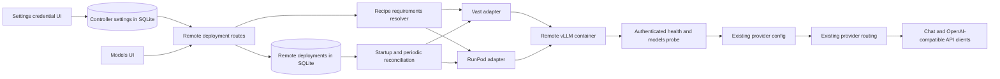

# Remote GPU provisioning

## Architecture summary

Remote GPU deployments are not local `InstanceRecord` variants. A local instance record is also the local GPU lease, its state depends on a local launcher handle, and its health probe always targets a loopback port. Reusing that record for a rented machine would break all three invariants.

The remote deployment service sits beside `modules/compute`. It reuses recipe normalization and the pure vLLM launch plan, but owns cloud offers, provider API calls, cloud lifecycle state, reconciliation, and teardown. The service persists an ordinary OpenAI-compatible provider route in a disabled state before it creates the remote instance, then enables that route only after the remote vLLM server is healthy. Existing `providerId/model` routing, SSE streaming, model discovery, and usage accounting then work without a second inference proxy.



The fork has no `origin/dev` after a fresh fetch on 2026-08-29. The feature branch therefore starts at the fork's only remote head, `origin/main` at `6ff4ef9`.

## Contracts

The shared wire contract is in `controller/contracts/remote-deployments.ts`.

```ts
type RemoteComputeProviderId = "vast" | "runpod";

interface RemoteComputeRequirements {
  recipe_id: string;
  model_id: string;
  backend: "vllm";
  min_vram_gb: number;
  weight_size_gb: number;
  gpu_count: 1;
  context_length: number;
  quantization: string | null;
}

interface RemoteComputeOffer {
  id: string;
  provider: RemoteComputeProviderId;
  gpu_name: string;
  gpu_memory_gb: number;
  gpu_count: number;
  system_memory_gb: number | null;
  cpu_cores: number | null;
  region: string | null;
  hourly_price: number;
  interruptible: boolean;
  reliability: number | null;
  availability: string | null;
  compatible: boolean;
}

interface RemoteDeploymentView {
  id: string;
  provider: RemoteComputeProviderId;
  provider_instance_id: string | null;
  recipe_id: string;
  model_id: string;
  backend: "vllm";
  status: RemoteDeploymentStatus;
  stage: RemoteDeploymentStage;
  message: string;
  offer: RemoteComputeOffer;
  requirements: RemoteComputeRequirements;
  remote_base_url: string | null;
  route_model_id: string | null;
  created_at: string;
  updated_at: string;
  last_health_at: string | null;
  last_health_status: "healthy" | "unhealthy" | "unknown";
  error: string | null;
}
```

The controller-only provider interface is in `controller/src/modules/remote-deployments/contracts.ts`.

```ts
interface RemoteComputeProvider {
  readonly id: RemoteComputeProviderId;
  readonly listOffers: (
    requirements: RemoteComputeRequirements,
  ) => Effect.Effect<readonly RemoteComputeOffer[], RemoteDeploymentFailure>;
  readonly createInstance: (
    spec: RemoteInstanceSpec,
  ) => Effect.Effect<RemoteProviderInstance, RemoteDeploymentFailure>;
  readonly getInstance: (
    id: string,
  ) => Effect.Effect<RemoteProviderInstance | null, RemoteDeploymentFailure>;
  readonly getConnectionInfo: (
    instance: RemoteProviderInstance,
  ) => Effect.Effect<RemoteConnectionInfo | null, RemoteDeploymentFailure>;
  readonly destroyInstance: (id: string) => Effect.Effect<void, RemoteDeploymentFailure>;
}
```

Provider-specific response bodies are decoded with Effect Schema before normalization. No raw provider payload crosses the controller boundary.

## Exact file map

New files:

- `controller/contracts/remote-deployments.ts`: shared API and SSE types.
- `controller/src/modules/remote-deployments/contracts.ts`: provider-neutral controller interfaces and failures.
- `controller/src/modules/remote-deployments/credentials.ts`: environment fallback merge and redacted credential status.
- `controller/src/modules/remote-deployments/credential-manager.ts`: persisted credential updates, effective credential selection, and live provider adapter replacement.
- `controller/src/modules/remote-deployments/requirements.ts`: recipe to Hugging Face model resolution and VRAM requirement calculation.
- `controller/src/modules/remote-deployments/bootstrap.ts`: authenticated vLLM container specification derived from the existing recipe and engine plan.
- `controller/src/modules/remote-deployments/providers/vast.ts`: Vast offer and instance lifecycle adapter.
- `controller/src/modules/remote-deployments/providers/runpod.ts`: RunPod offer and Pod lifecycle adapter.
- `controller/src/modules/remote-deployments/store.ts`: SQLite persistence and Effect Schema decoding.
- `controller/src/modules/remote-deployments/service.ts`: lifecycle orchestration, provider registration, cleanup, and reconciliation.
- `controller/src/modules/remote-deployments/routes.ts`: provider status, offer, deployment, and destroy routes.
- `controller/src/modules/remote-deployments/supervisor.ts`: bounded periodic reconciliation.
- `controller/src/services/provider-configs.ts`: one owner for persisted provider config mutations used by manual and managed providers.
- `frontend/src/lib/api/remote-deployments.ts`: typed frontend API client.
- `frontend/src/features/settings/remote-compute-settings.tsx`: password inputs, redacted status, rotation, and removal controls.
- `frontend/src/features/recipes/remote-deployment/remote-deployment-drawer.tsx`: offer and lifecycle UI.
- `frontend/src/features/recipes/remote-deployment/remote-deployment-model.ts`: drawer state and controller event reconciliation.

Existing files changed:

- `controller/src/config/env.ts`: read controller-only credential presence without serializing credential values.
- `controller/src/stores/controller-settings-store.ts`: persist remote provider credentials in the existing mode-0600 controller database.
- `controller/src/config/persisted-config.ts`: mark generated provider routes as deployment-managed.
- `controller/src/modules/compute/contracts.ts` and `controller/src/modules/compute/engines/shared.ts`: allow a container launch plan to use a registry model id instead of a local mount. Local plans remain unchanged.
- `controller/src/modules/studio/provider-routes.ts`: use the shared provider-config mutation service.
- `controller/src/app-context.ts`: acquire the deployment store and service.
- `controller/src/main.ts`: run startup reconciliation and the remote supervisor.
- `controller/src/http/app.ts`: register remote deployment routes.
- `controller/contracts/controller-events.ts`: add `remote_deployment_updated` to the existing SSE stream.
- `frontend/src/lib/api/create-api-client.ts` and `frontend/src/lib/types.ts`: expose the new shared contract and API.
- `frontend/src/features/recipes/recipes-content/recipe-row.tsx`, `recipes-table.tsx`, `types.ts`, `recipes-content-model.ts`, and `recipes-content-view.tsx`: add the "Deploy remote" entry and mount the drawer.
- `controller.md`: document the final routes and lifecycle after implementation.

## MVP scope

Included:

- Vast.ai and RunPod.
- Linux NVIDIA offers with exactly one GPU.
- vLLM using the existing pinned or recipe-selected image.
- Hugging Face models whose repository id can be recovered from a completed Local Studio download or an explicit `org/model` recipe source.
- A minimum VRAM requirement based on known weight bytes plus 25 percent runtime headroom, rounded up to whole GiB.
- On-demand offers. Interruptible metadata is normalized when a provider returns it, but the first deploy flow defaults to non-interruptible capacity.
- A generated vLLM API key for every deployment.
- Offer browsing, provision progress, readiness, ready state, destroy, and failed cleanup in the Models UI.
- Provider routing enabled only after authenticated `/health` and `/v1/models` succeed.
- Startup and periodic reconciliation.

Excluded from this MVP:

- SGLang, llama.cpp, AMD, multi-GPU, tensor parallel cloud deployments, arbitrary shell bootstrap, custom images without the vLLM entrypoint, benchmark-based ranking, automatic network volumes, SSH tunnels, and serverless endpoints.
- Exact CPU, RAM, and region selection on RunPod when its pre-provisioning GPU catalog does not return machine-level fields. Those fields remain `null`, not guessed.
- Automatic spending limits or budget approvals. The UI shows the quoted hourly rate and requires an explicit deploy click.

## Provider integration

Vast uses the official REST API. Offers come from `POST https://console.vast.ai/api/v0/bundles/`, creation accepts an offer with `PUT /api/v0/asks/{offerId}/`, instance state comes from `GET /api/v0/instances/{id}/`, and teardown uses `DELETE /api/v0/instances/{id}/`. Search requires verified, rentable, single-GPU capacity with enough VRAM, at least one direct port, and CUDA compute capability 8.0 or newer. This removes P40, V100, and other pre-Ampere offers before they reach the compatible list. The request starts the selected vLLM image directly and opens only the inference port. Vast maps that internal port to a random external TCP port, which the adapter resolves from instance data.

RunPod uses the official GraphQL GPU catalog for memory, price, stock, and compatible GPU counts. Pod lifecycle uses `https://rest.runpod.io/v1/pods`. The vLLM port is exposed as an HTTP service and resolves to `https://{podId}-8000.proxy.runpod.net`.

References:

- [Vast offer search](https://docs.vast.ai/api-reference/search/search-offers)
- [Vast instance creation](https://docs.vast.ai/api-reference/creating-instances-with-api)
- [Vast networking and port mapping](https://docs.vast.ai/guides/instances/connect/networking)
- [RunPod GPU catalog and availability](https://docs.runpod.io/sdks/graphql/manage-pods)
- [RunPod Pod creation](https://docs.runpod.io/api-reference/pods/POST/pods)

## Persistence and migration

`RemoteDeploymentStore` creates a `remote_deployments` table in the existing controller SQLite database. Each row stores a schema-validated JSON record plus indexed lifecycle timestamps. Creating the table is additive and idempotent, so no generated migration file is involved.

The persisted record contains provider, provider instance id, normalized selected offer, price at creation, region, recipe id, Hugging Face model id, backend, status, stage, remote base URL, provider route id, creation and update timestamps, last health time and result, and a redacted error summary.

Settings > Remote compute stores provider API keys and the optional Hugging Face token in the existing controller SQLite database. The database is mode `0600`. Credential values never appear in GET responses; the browser receives only `configured` and `source` fields. Saving or rotating a key replaces the in-memory provider adapter immediately, so no controller restart is required.
Controller environment variables remain fallback inputs for unattended setups:

- `LOCAL_STUDIO_VAST_API_KEY`
- `LOCAL_STUDIO_RUNPOD_API_KEY`
- `LOCAL_STUDIO_HF_TOKEN`, with the existing `HF_TOKEN` and `HUGGINGFACE_TOKEN` fallbacks

Settings values take precedence over environment fallbacks. Removing a Settings value reveals the corresponding environment fallback when one exists. The generated inference key is stored only in the controller's mode-0600 provider config, never in the deployment view or browser response. Remote vLLM receives the same value through `VLLM_API_KEY`; it is not included in the process command line or vLLM's startup argument summary. The managed provider record includes the owning deployment id so reconciliation and teardown can repair both sides.

On controller startup, reconciliation runs before the periodic supervisor:

1. Load every non-terminal deployment.
2. Query its provider instance by id.
3. If the instance is missing, remove its provider route and mark it `missing`.
4. If it still exists but is not ready, resume connection and readiness checks within the original deadline.
5. If it is ready and healthy, restore or repair the provider route.
6. If the provider query fails transiently, keep the record and expose the error. Do not treat a timeout as proof that the rented GPU disappeared.

## Failure model

- Missing provider credential: return a configured=false provider status and reject provider calls before any external mutation.
- Model id or weight size cannot be resolved: reject offer search with a concrete recipe error.
- No compatible offer: return requirements with an empty offer list.
- Offer disappeared before creation: keep no deployment unless the provider returned an instance id.
- Provider returned an instance id but local persistence failed: immediately attempt provider teardown and report both outcomes.
- Remote container exited or bootstrap failed: persist the failure, unregister any route, and destroy the instance.
- Readiness deadline expired: persist the timeout, unregister any route, and destroy the instance.
- Provider instance disappeared externally: remove routing and mark the deployment `missing`.
- Provider API timeout during reconciliation: keep the prior state and try again later.
- Provider registration failed after readiness: destroy the instance rather than leave an untracked billed GPU.
- Destroy succeeded: remove the managed provider route and mark the deployment `destroyed` while retaining its audit record.
- Destroy failed: keep the route disabled, mark `destroy_failed`, and let the user retry. Never delete the only local record of a possibly billable instance.
- Controller shuts down during provisioning: persist the provider instance id before waiting for readiness, then resume reconciliation after restart.

Provider response bodies, authorization headers, generated inference keys, Hugging Face tokens, and environment maps must never be logged or returned. User-visible errors contain status and operation names only.

## API

- `GET /remote-deployments/providers`: provider configured flags and supported MVP capabilities.
- `GET /remote-deployments/credentials`: redacted configured/source status for Vast.ai, RunPod, and Hugging Face credentials.
- `PUT /remote-deployments/credentials`: save, rotate, or remove any credential. Omitted fields are preserved, strings replace stored values, and `null` removes a stored value. The response contains status only.
- `POST /remote-deployments/offers`: resolve one recipe's requirements and return normalized compatible and incompatible offers.
- `GET /remote-deployments`: list deployment views, optionally filtered by recipe id.
- `GET /remote-deployments/:deploymentId`: return one deployment view.
- `POST /remote-deployments`: revalidate the selected offer, create the provider instance, persist its id, and return the provisioning view with HTTP 202. Supervised readiness continues after the response.
- `DELETE /remote-deployments/:deploymentId`: disable routing, destroy the provider instance, and persist the terminal result.

All request bodies use Effect Schema and the existing bounded-body helpers. The controller emits `remote_deployment_updated` over its current SSE channel after every persisted transition.

## Validation

The repository policy forbids adding automated test files. A one-off in-memory probe run with the controller's pinned Effect runtime covers these nine contract scenarios without adding a test artifact:

1. compatible and incompatible offer filtering;
2. Vast and RunPod response normalization;
3. failed provisioning cleanup;
4. remote bootstrap container failure and teardown;
5. readiness timeout and teardown;
6. explicit destroy and route removal;
7. restart reconciliation and route restoration;
8. external instance disappearance;
9. browser payload omission of provider keys, inference keys, and recipe environment values.

The 2026-08-30 completion audit passed all nine scenarios. The lifecycle probe uses the real `RemoteDeploymentService`, provider-route persistence, and public deployment view with in-memory provider and deployment-store boundaries. A separate provider probe decodes representative Vast and RunPod API payloads through the real adapters, including nullable RunPod catalog fields.

The visible UI path is checked against an isolated local controller: Models → Your servers → Server actions → Deploy remote. The no-credential state renders both providers, keeps external actions disabled, and produces no browser console errors.

## Local end-to-end run

1. Start the normal development workflow with `npm run dev`.
2. Open Settings → Remote compute. Paste a Vast.ai API key and/or RunPod API key, then click Save. Add a Hugging Face token only for a private or gated model. The fields clear after saving and values cannot be read back.
3. Open Models → Your servers, open a vLLM recipe's actions, and choose Deploy remote.
4. Select configured providers, refresh offers, compare compatible and incompatible rows, choose one offer, and click Deploy. The quoted hourly price applies until the instance is destroyed.
5. Wait for `ready`, then use the displayed `remote-{provider}-{deploymentId}/{model}` id through the existing Local Studio chat or OpenAI-compatible controller API.
6. Click Destroy and verify the deployment reaches `destroyed`. If teardown fails, retry while the route remains disabled.

For unattended controller setup, copy `.env.example` to ignored `.env.local` and use the documented environment fallbacks instead of Settings.

The controller-side contract can be inspected without spending money through `GET /remote-deployments/credentials`, `GET /remote-deployments/providers`, and the persisted deployment list. Offer lookup may call provider catalog APIs, but instance creation happens only after the explicit Deploy action.

## Live acceptance status

RunPod completed the paid UI-to-inference-to-destroy path on 2026-08-30 with an RTX 3090 offer and the Qwen3.8 27B Heretic W4A16 recipe. Settings supplied the credential without a controller restart. The deployment reached `ready`, exposed the qualified `remote-runpod-{deploymentId}/{model}` route, returned a streamed agent response with the recipe's 4096-token context, and reached `destroyed` from the UI. The managed provider route was removed after teardown while the terminal deployment record remained for audit history.

The recipe did not configure a vLLM tool-call parser. Its model metadata therefore advertises tool calling as unavailable, and Local Studio sends an empty tool set for that deployment instead of allowing vLLM to reject `tool_choice: "auto"`. Reasoning remains available through the derived `qwen3` reasoning parser.

Vast live acceptance is still pending. The configured account had no balance, so no Vast instance was created and no cost was incurred.

## Known limitations

- RunPod has completed live UI-to-inference-to-destroy acceptance. Vast still requires a funded account and explicit approval to incur cost.
- RunPod uses its provider HTTPS proxy. Vast exposes the mapped vLLM port directly as `http://{publicIp}:{mappedPort}`. It is protected by a generated high-entropy bearer key, but this Vast MVP path does not provide provider-native TLS.
- VRAM compatibility is an estimate based on known weight bytes plus 25 percent headroom. Long contexts, model architecture, quantization behavior, and KV cache demand can still make an apparently compatible GPU fail readiness.
- Price and availability are snapshots. There is no budget cap, automatic maximum price, reservation, or spend approval workflow.
- The default engine image follows the existing vLLM image selection and may use a moving tag. Pin a recipe-selected vLLM image tag when immutable image reproduction is required.
- Recipe environment variables are sent to the selected provider because they are part of the launch contract. The UI reports only their count and never their names or values.
- If the controller process dies after a provider accepts creation but before the returned instance id is persisted, the current provider-neutral interface cannot rediscover that instance by deployment label. Check the provider console after such a crash.
- RunPod catalog offers do not include final machine region, CPU, or system RAM, so these fields remain unknown until the API offers a trustworthy pre-provisioning boundary.
- The MVP supports vLLM, NVIDIA, one GPU, Hugging Face model ids, and on-demand Pods/instances only. It does not cover SGLang, AMD, multi-GPU, serverless, SSH bootstrap, network volumes, or custom images without the vLLM entrypoint.
